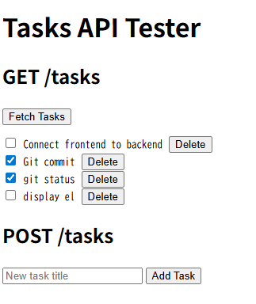

# Tasks API Tester
A minimal full-stack app to test CRUD operations with a REST API and web UI.  
This project focuses on practical API design and frontend integration.  



## What
A simple task management API backed by SQLite.  
Built with ES Modules (import/export) and a minimal browser-based UI.

## Features
- Create tasks
- List tasks
- Persistent storage with SQLite
- All operations can be executed from the browser UI
- Full CRUD operations via REST API

## Why
To practice real-world CRUD workflows
and backend API design.

## Tech
- Node.js
- Express
- SQLite (persistent local database)

## API Endpoints
- GET /tasks
- POST /tasks
- PUT /tasks/:id
- DELETE /tasks/:id

## How to run
### Prerequisites
- Node.js >= 18
- SQLite3
- `package.json` includes:
  ```json
  {
    "scripts": {
      "dev": "node index.js"
    }
  }
  ```

### Steps

1. Install dependencies

```bash
npm install
```

2. Initialize database
```bash
sqlite3 db.sqlite ".read schema.sql"
sqlite3 db.sqlite ".read seed.sql"
```

3. Start dev server
```bash
npm run dev
```
The frontend is served from the same Express server.

## How to reset tasks
```bash
sqlite3 db.sqlite ".read reset.sql"
```

## Possible Improvements
- Improve frontend UI
- Add validation and error handling